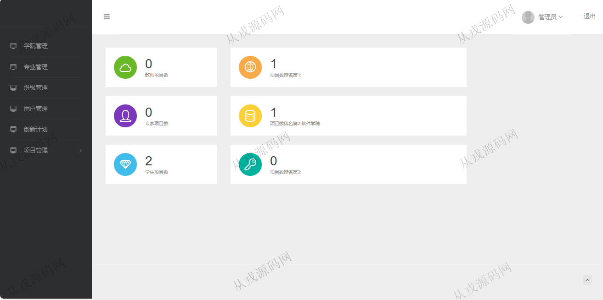
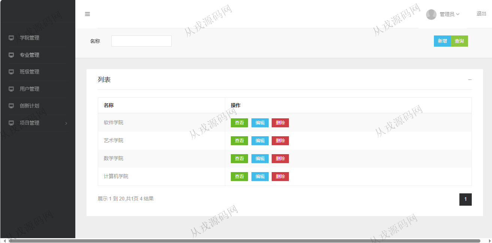
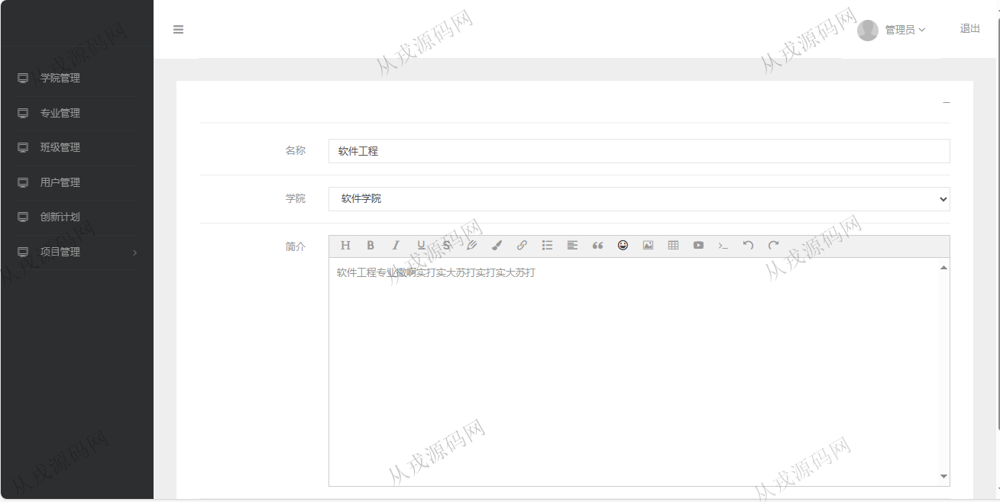
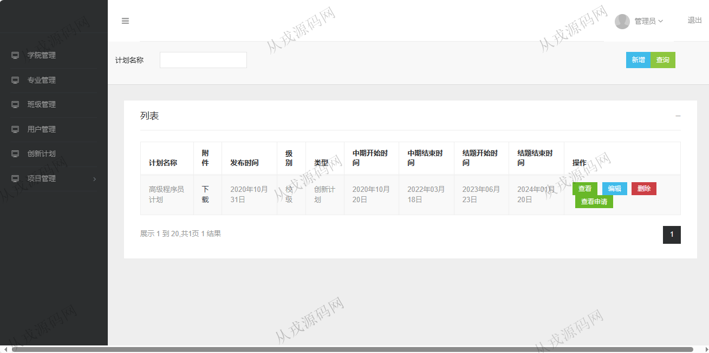
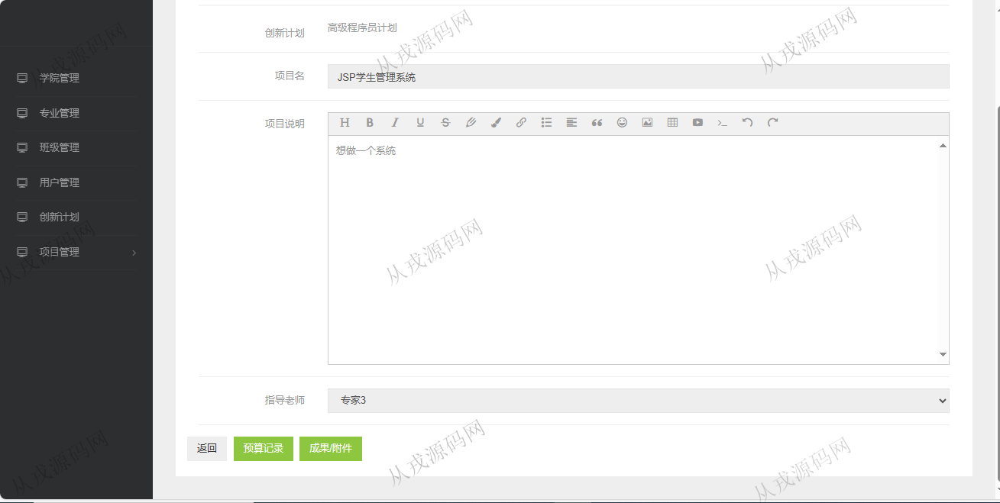
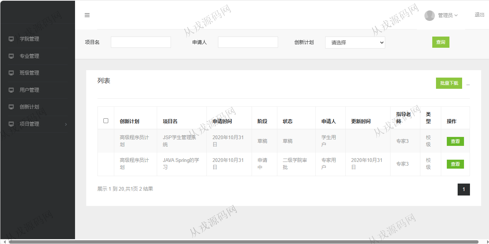

<h1 align="center">171.大学生创新创业项目管理系统</h1>

- <b>完整代码获取地址：从戎源码网 ([https://armycodes.com/](https://armycodes.com/))</b>
- <b>技术探讨、资料分享，请加QQ群：692619798</b> 
- <b>作者微信：19941326836  QQ：952045282</b> 
- <b>承接计算机毕业设计、Java毕业设计、Python毕业设计、深度学习、机器学习</b>
- <b>选题+开题报告+任务书+程序定制+安装调试+论文+答辩ppt 一条龙服务</b>
- <b>所有选题地址 ([https://github.com/YuLin-Coder/AllProjectCatalog](https://github.com/YuLin-Coder/AllProjectCatalog)) </b>

## 项目介绍
基于ssm的大学生创新创业项目管理系统：前端 jsp、jquery，后端 maven、springmvc、spring、mybatis；角色分为管理员、学生；集成学院、专业、班级管理，创新计划，项目管理等功能于一体的系统。

## 功能介绍

- 学院管理：学院信息的增删改查，按名称模糊搜索查询，学院简介信息支持富文本编辑
- 专业管理：专业信息的增删改查，按名称模糊搜索，按学院选择查询
- 班级管理：班级信息的增删改查，，按名称模糊搜索，按学院、专业选择查询
- 用户管理：用户信息的增删改查，多条件搜索查询
- 创新计划：创新计划信息增删改查，详情信息支持富文本编辑，上传附件，查看申请
- 项目管理：项目列表查询，申请审核

## 环境

- <b>IntelliJ IDEA 2021.3</b>

- <b>Mysql 5.7.26</b>

- <b>Tomcat 7.0.73</b>

- <b>JDK 1.8</b>

## 运行截图

